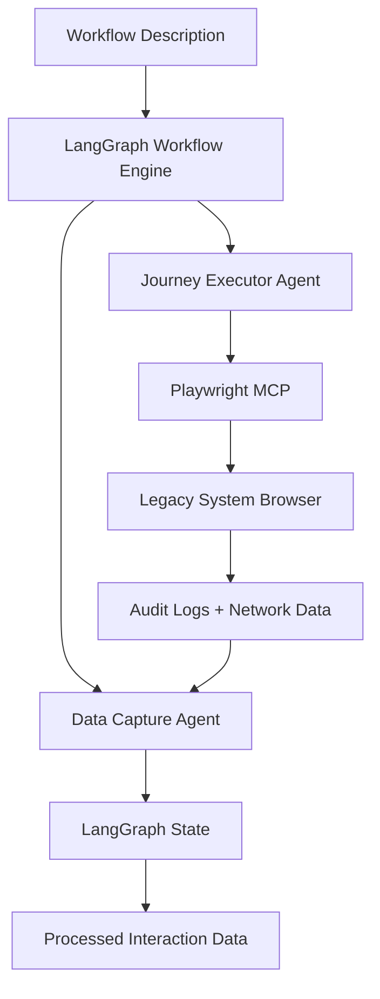

# AIFSD legacy system reverse engineering

AI-powered reverse engineering of legacy web applications using LangGraph and Playwright MCP.

## Project overview

This project uses AI agents to reverse engineer legacy software systems through blackbox analysis, generating modern code recreations without access to source code.

### Core technologies

- **LangGraph**: Multi-agent workflow coordination
- **Playwright MCP**: Browser automation and data capture
- **Python**: Backend code generation target
- **React/TypeScript**: Frontend code generation target

## Foundation complete (week 1)

### Implemented components

#### State management (`src/workflows/state_management.py`)

- ✅ Comprehensive state structure for reverse engineering workflow
- ✅ Typed state management with all required fields
- ✅ Support for captured data, analysis results, and generated code
- ✅ Full test coverage

#### LangGraph workflow (`src/workflows/reverse_engineering.py`)

- ✅ Multi-agent workflow with Journey Executor and Data Capture agents
- ✅ State persistence between agents
- ✅ Error handling and logging
- ✅ Async execution support
- ✅ Full test coverage

#### Playwright MCP integration (`src/integrations/playwright_mcp.py`)

- ✅ Browser automation client interface
- ✅ Audit log capture
- ✅ Network request capture
- ✅ Mock implementation for testing
- ✅ Full test coverage

#### Test suite

- ✅ 11 comprehensive tests following TDD principles
- ✅ Unit tests for state management
- ✅ Integration tests for workflow execution
- ✅ Mock-based testing for external dependencies
- ✅ 100% test pass rate

## Prerequisites

- Python 3.11 or higher
- pip package manager
- Git for version control

## Installation

```bash
# Clone repository
git clone <repository-url>
cd AIFSD-client-blackbox-langgraph

# Install dependencies
pip install -r requirements.txt

# Run tests to verify installation
python -m pytest tests/ -v

# Run demo to see it working
python demo_basic_workflow.py
```

## Usage

### Basic workflow execution

```python
from src.workflows.reverse_engineering import ReverseEngineeringWorkflow
from src.workflows.state_management import create_initial_state

# Create initial state
state = create_initial_state(
    workflow_description="Navigate to login page and click login button",
    domain="accounts_payable"
)

# Execute workflow
workflow = ReverseEngineeringWorkflow()
final_state = await workflow.execute(state)

# Access results
print(f"Captured {len(final_state['network_requests'])} network requests")
print(f"Processed {len(final_state['user_interactions'])} interactions")
```

### Running tests

```bash
# Run all tests
python -m pytest tests/ -v

# Run specific test file
python -m pytest tests/test_state_management.py -v

# Run with coverage
python -m pytest tests/ --cov=src
```

## Current capabilities

### Working features

- ✅ **Multi-agent coordination**: LangGraph workflow with state management
- ✅ **Browser automation**: Playwright MCP integration for UI interaction
- ✅ **Data capture**: Comprehensive logging of browser interactions and network requests
- ✅ **Data correlation**: Basic correlation between UI actions and API calls
- ✅ **State persistence**: Maintains context across agent interactions
- ✅ **Error handling**: Graceful error handling and recovery

### Test results

```
11 tests passing
- 4 state management tests
- 6 workflow execution tests
- 1 integration test
```

## Architecture



## Next steps (week 2)

### Immediate priorities

#### Pattern analysis agent

- [ ] API endpoint detection from network requests
- [ ] Business logic inference from interaction sequences
- [ ] UI component pattern recognition
- [ ] Data flow analysis

#### Basic code generation

- [ ] Simple API endpoint generation (FastAPI)
- [ ] Basic React component generation
- [ ] Database schema inference
- [ ] Code quality validation

#### Enhanced workflow

- [ ] Conditional execution paths
- [ ] Iterative refinement loops
- [ ] Advanced error handling
- [ ] Performance optimization

### Medium-term goals (weeks 3-4)

#### Advanced pattern recognition

- [ ] Complex business logic patterns
- [ ] Multi-step workflow analysis
- [ ] Data relationship mapping
- [ ] Authentication flow detection

#### Production-ready code generation

- [ ] Complete backend applications
- [ ] Full frontend applications with routing
- [ ] Database migrations
- [ ] API documentation generation

## Testing strategy

### TDD approach

Following test-driven development principles:

1. **Write failing tests first** - Define expected behavior
2. **Implement minimal code** - Just enough to pass tests
3. **Refactor and improve** - Clean up while maintaining tests
4. **Repeat incrementally** - Add features one at a time

### Test categories

- **Unit tests**: Individual component testing
- **Integration tests**: Multi-component interaction testing
- **Workflow tests**: End-to-end workflow execution
- **Mock tests**: External dependency simulation

## Project structure

```
AIFSD-client-blackbox-langgraph/
├── src/
│   ├── workflows/                # LangGraph workflows
│   │   ├── state_management.py      # State definitions
│   │   └── reverse_engineering.py   # Main workflow
│   ├── integrations/             # External integrations
│   │   └── playwright_mcp.py        # Playwright MCP client
│   └── __init__.py
├── tests/
│   ├── test_state_management.py     # State management tests
│   ├── test_basic_workflow.py       # Workflow tests
│   └── test_integration_basic.py    # Integration tests
├── memory-bank/                  # Project documentation
├── requirements.txt              # Dependencies
├── demo_basic_workflow.py        # Demo script
└── README.md                     # This file
```

## Success metrics

### Foundation phase (complete)

- [x] LangGraph workflow operational
- [x] Playwright MCP integration working
- [x] Basic agent communication functional
- [x] State management robust
- [x] Test coverage comprehensive

### Next phase targets

- [ ] Pattern recognition accuracy >80%
- [ ] API endpoint detection >90%
- [ ] Basic code generation functional
- [ ] End-to-end workflow for simple use cases

## Contributing

### Development workflow

1. Follow TDD principles - tests first
2. Maintain test coverage
3. Use type hints throughout
4. Document new features
5. Update memory bank documentation

### Code quality

- Black formatting
- Type checking with mypy
- Comprehensive testing
- Clear documentation

## Documentation

- **Memory bank**: Comprehensive project documentation in `memory-bank/`
- **API docs**: Generated from code docstrings
- **Architecture**: Detailed system design documentation
- **User guides**: Step-by-step usage instructions

---

**Status**: Foundation complete ✅  
**Next milestone**: Pattern analysis agent (week 2)  
**Team**: AIFSD development team
