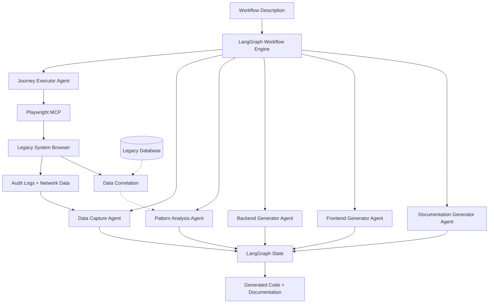
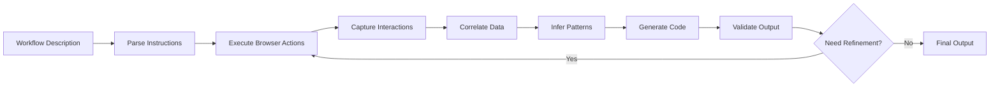
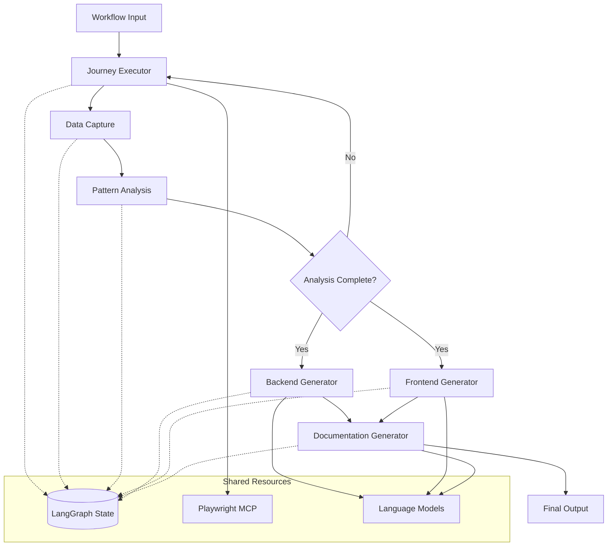

# System patterns

## System architecture

### High-level architecture



### Core architectural principles

#### 1. Multi-agent coordination with LangGraph

- **State-driven workflow**: Centralized state management across all agents
- **Conditional execution**: Different agent paths based on discovered patterns
- **Iterative refinement**: Agents can loop back for additional data gathering
- **Parallel processing**: Multiple agents can work simultaneously on different aspects

#### 2. Blackbox reverse engineering approach

- **No source code dependency**: Pure behavioral analysis through browser automation
- **Systematic exploration**: Comprehensive coverage of system capabilities
- **Pattern recognition**: AI-driven inference of business logic from interactions
- **Behavioral validation**: Generated understanding tested against actual system

#### 3. Modern code generation

- **Clean architecture**: Well-structured, maintainable output code
- **Technology best practices**: Modern development patterns and frameworks
- **Comprehensive documentation**: Automated generation of system documentation
- **Integration ready**: Generated code designed for easy integration and extension

## Key technical decisions

### LangGraph workflow architecture

#### Agent workflow design

```python
# Core LangGraph workflow for reverse engineering
class ReverseEngineeringWorkflow:
    def __init__(self):
        self.workflow = StateGraph(ReverseEngineeringState)

        # Define agents as workflow nodes
        self.workflow.add_node("journey_executor", self.execute_journey)
        self.workflow.add_node("data_capturer", self.capture_interactions)
        self.workflow.add_node("pattern_analyzer", self.analyze_patterns)
        self.workflow.add_node("backend_generator", self.generate_backend)
        self.workflow.add_node("frontend_generator", self.generate_frontend)
        self.workflow.add_node("documentation_generator", self.generate_docs)

        # Define workflow transitions
        self.workflow.add_edge("journey_executor", "data_capturer")
        self.workflow.add_edge("data_capturer", "pattern_analyzer")
        self.workflow.add_conditional_edges(
            "pattern_analyzer",
            self.determine_next_action,
            {
                "more_data_needed": "journey_executor",
                "generate_backend": "backend_generator",
                "generate_frontend": "frontend_generator",
                "generate_docs": "documentation_generator",
                "complete": END
            }
        )
```

#### State management strategy

```python
class ReverseEngineeringState(TypedDict):
    # Input and workflow control
    workflow_description: str
    current_domain: str  # AP, consignment, returns, parts
    iteration_count: int

    # Captured data
    playwright_logs: List[Dict]
    network_requests: List[Dict]
    dom_changes: List[Dict]
    user_interactions: List[Dict]

    # Analysis results
    inferred_api_endpoints: List[Dict]
    database_schema: Dict
    business_logic_patterns: List[Dict]
    ui_component_patterns: List[Dict]

    # Generated outputs
    backend_code: Dict[str, str]  # filename -> code
    frontend_code: Dict[str, str]  # filename -> code
    documentation: Dict[str, str]  # doc_type -> content

    # Workflow state
    analysis_complete: bool
    generation_targets: List[str]
    next_actions: List[str]
```

### Playwright MCP integration patterns ✅ MAJOR UPDATE

#### Real browser automation with state persistence ✅ NEW

```python
class PlaywrightMCPIntegration:
    def __init__(self, langgraph_state: ReverseEngineeringState):
        self.mcp_client = PlaywrightMCPClient()
        self.state = langgraph_state

    async def navigate_to_url(self, url: str):
        # Execute real browser navigation via MCP
        result = await self.mcp_client.navigate_to_url(url)

        # Capture comprehensive interaction data
        audit_data = {
            "logs": self.mcp_client.get_audit_logs(),
            "network": self.mcp_client.get_network_requests(),
            "dom_changes": self.mcp_client.get_dom_changes(),
        }

        # Update LangGraph state
        self.state["playwright_logs"].extend(audit_data["logs"])
        self.state["network_requests"].extend(audit_data["network"])
        self.state["dom_changes"].extend(audit_data["dom_changes"])

        return result, audit_data

    async def click_element(self, element_description: str, selector: str):
        # Execute real element clicking via MCP
        result = await self.mcp_client.click_element(element_description, selector)

        # Update state with interaction data
        self._update_state_with_interaction(result)
        return result

    async def execute_user_journey(self, journey_steps: list):
        # Execute complete multi-step workflow
        result = await self.mcp_client.execute_user_journey(journey_steps)

        # Comprehensive state update with all captured data
        self._update_state_with_journey_data(result)
        return result
```

#### Data correlation and analysis

```python
class DataCorrelationEngine:
    def correlate_ui_to_data(self, ui_interactions, network_requests, db_changes=None):
        correlations = []

        for interaction in ui_interactions:
            # Find related network requests
            related_requests = self.find_temporal_matches(
                interaction, network_requests, time_window=2.0
            )

            # Correlate with database changes if available
            related_db_changes = None
            if db_changes:
                related_db_changes = self.find_temporal_matches(
                    interaction, db_changes, time_window=5.0
                )

            correlations.append({
                "ui_action": interaction,
                "api_calls": related_requests,
                "data_changes": related_db_changes,
                "inferred_business_logic": self.infer_logic(
                    interaction, related_requests, related_db_changes
                )
            })

        return correlations
```

## Design patterns in use

### Agent specialization patterns

#### 1. Journey Executor Agent

```python
class JourneyExecutorAgent:
    def __init__(self, playwright_integration):
        self.playwright = playwright_integration
        self.instruction_parser = InstructionParser()
        self.workflow_tracker = WorkflowTracker()

    def execute(self, workflow_description: str, state: ReverseEngineeringState):
        # Parse natural language workflow into browser actions
        actions = self.instruction_parser.parse(workflow_description)

        execution_log = []
        for action in actions:
            result, audit_data = self.playwright.execute_workflow_step(action)
            execution_log.append({
                "action": action,
                "result": result,
                "audit_data": audit_data,
                "timestamp": datetime.now()
            })

        # Update state with execution results
        state["user_interactions"].extend(execution_log)
        return state
```

#### 2. Pattern Analysis Agent (✅ Comprehensive implementation complete) ✅ UPDATED

```python
class PatternAnalysisAgent:
    """
    Comprehensive pattern analysis agent for reverse engineering.

    Capabilities:
    - API endpoint detection with path pattern recognition
    - Query parameter pattern extraction
    - Mixed path/query parameter handling
    - HTTP method differentiation
    - Error resilience for invalid URLs
    - Request/response body pattern analysis foundation
    - Duplicate endpoint consolidation with call tracking
    """

    def analyze_api_patterns(self, state: ReverseEngineeringState) -> ReverseEngineeringState:
        """Analyze network requests to identify comprehensive API patterns."""
        network_requests = state.get("network_requests", [])
        endpoint_patterns = {}

        for request in network_requests:
            endpoint = self._extract_endpoint_pattern(request)
            if endpoint:
                key = self._create_endpoint_key(endpoint)

                if key in endpoint_patterns:
                    endpoint_patterns[key]["call_count"] += 1
                else:
                    endpoint["call_count"] = 1
                    endpoint_patterns[key] = endpoint

        # Convert to list and update state
        endpoints = list(endpoint_patterns.values())
        updated_state = state.copy()
        updated_state["inferred_api_endpoints"] = endpoints
        return updated_state

    def _extract_endpoint_pattern(self, request: Dict) -> Dict:
        """Extract comprehensive endpoint patterns from network requests."""
        url = request.get("url", "")
        method = request.get("method", "")

        if not url or not method:
            return None

        # Parse URL components
        parsed = urlparse(url)
        base_url = f"{parsed.scheme}://{parsed.netloc}"
        path = parsed.path

        # Pattern detection - replace numeric IDs with {id}
        path_pattern = re.sub(r"/\d+", "/{id}", path)

        # Handle query parameters
        if parsed.query:
            query_pattern = self._extract_query_pattern(parsed.query)
            path_pattern = f"{path_pattern}?{query_pattern}"

        return {
            "method": method,
            "base_url": base_url,
            "path_pattern": path_pattern,
            "original_url": url,
        }

    def _extract_query_pattern(self, query_string: str) -> str:
        """Extract query parameter patterns preserving order."""
        param_pairs = query_string.split("&")
        pattern_parts = []

        for pair in param_pairs:
            if "=" in pair:
                param_name = pair.split("=")[0]
                pattern_parts.append(f"{param_name}={{{param_name}}}")

        return "&".join(pattern_parts)

    def _create_endpoint_key(self, endpoint: Dict) -> str:
        """Create unique key for endpoint consolidation."""
        return f"{endpoint['method']}:{endpoint['base_url']}{endpoint['path_pattern']}"
```

#### 3. Code Generation Agents (⏳ Next priority)

```python
class BackendGeneratorAgent:
    """
    Generate FastAPI backend code from analyzed patterns.

    Planned capabilities:
    - FastAPI endpoint generation from API patterns
    - SQLAlchemy model generation from data patterns
    - Authentication middleware generation
    - Validation logic generation
    - Error handling implementation
    """

    def generate_backend_code(self, state: ReverseEngineeringState) -> ReverseEngineeringState:
        """Generate comprehensive backend code from patterns."""
        # Implementation planned for next development phase
        pass

class FrontendGeneratorAgent:
    """
    Generate React/TypeScript frontend code from patterns.

    Planned capabilities:
    - React component generation from UI patterns
    - TypeScript interface generation from API patterns
    - Form generation from validation patterns
    - State management setup
    - API client generation
    """

    def generate_frontend_code(self, state: ReverseEngineeringState) -> ReverseEngineeringState:
        """Generate comprehensive frontend code from patterns."""
        # Implementation planned for next development phase
        pass
```

### Data flow patterns

#### Reverse engineering data flow



#### State evolution pattern

```python
# State evolution through workflow
def workflow_state_evolution():
    # Initial state
    state = ReverseEngineeringState(
        workflow_description="User login and dashboard access",
        current_domain="accounts_payable",
        iteration_count=0,
        # ... other initial values
    )

    # Journey execution updates
    state = journey_executor.execute(state)
    # state now contains playwright_logs, network_requests, etc.

    # Data capture and analysis
    state = data_capturer.capture(state)
    state = pattern_analyzer.analyze(state)
    # state now contains inferred_api_endpoints, business_logic_patterns, etc.

    # Code generation
    state = backend_generator.generate(state)
    state = frontend_generator.generate(state)
    # state now contains backend_code, frontend_code

    # Documentation generation
    state = documentation_generator.generate(state)
    # state now contains comprehensive documentation

    return state
```

## Component relationships

### Agent dependency graph



### Data transformation pipeline

```python
# Data transformation through agents
class DataTransformationPipeline:
    def transform_raw_to_patterns(self, raw_data):
        # Raw browser data -> Structured patterns
        return {
            "api_patterns": self.extract_api_patterns(raw_data["network"]),
            "ui_patterns": self.extract_ui_patterns(raw_data["dom"]),
            "workflow_patterns": self.extract_workflow_patterns(raw_data["interactions"])
        }

    def transform_patterns_to_code(self, patterns):
        # Structured patterns -> Generated code
        return {
            "backend": self.generate_backend_from_patterns(patterns["api_patterns"]),
            "frontend": self.generate_frontend_from_patterns(patterns["ui_patterns"]),
            "docs": self.generate_docs_from_patterns(patterns)
        }
```

## Scalability considerations

### Horizontal scaling patterns

- **Agent parallelization**: Multiple agents can work on different domains simultaneously
- **Workflow partitioning**: Large workflows can be broken into smaller, parallel tasks
- **State sharding**: Different aspects of state can be managed independently
- **Resource optimization**: Efficient use of LLM calls and browser automation resources

### Performance optimization patterns

- **Caching strategies**: Cache pattern recognition results and code generation templates
- **Incremental analysis**: Build on previous analysis rather than starting from scratch
- **Selective execution**: Only re-execute agents when relevant state changes
- **Batch processing**: Group similar operations for efficiency

### Monitoring and observability

- **Agent performance tracking**: Monitor execution time and success rates for each agent
- **State evolution logging**: Track how state changes through the workflow
- **Pattern recognition accuracy**: Measure quality of inferred patterns
- **Code generation quality**: Track generated code functionality and maintainability
